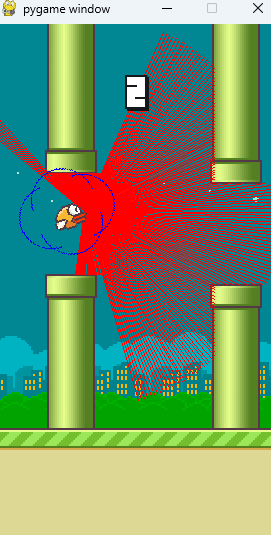

# Flappy Bird 强化学习（仅PPO） / Flappy Bird Reinforcement Learning (PPO Only)

本项目仅关注自定义 PPO 实现，位于 `v12_最终版本.py`。通过 `Gymnasium` 的 `FlappyBird-v0` 环境训练智能体，并支持断点续训与“无限测试”模式。

This project focuses on a custom PPO implementation in `v12_最终版本.py`, training an agent in the `Gymnasium` `FlappyBird-v0` environment, with resume training and an infinite test mode.

## 文件与结构 / Files & Structure
### 这是最终版本
- `v12_最终版本.py`: 训练与测试主脚本（PPO 自定义实现）
- `manual_models/`: PPO 模型权重保存目录（`.pth`）

## 依赖 / Dependencies
```bash
pip install gymnasium flappy-bird-gymnasium numpy tqdm torch
```
- GPU（可选）：`pip install torch torchvision torchaudio --index-url https://download.pytorch.org/whl/cu121`
- 验证 GPU：`python test_gpu.py`

## 关键功能 / Key Components
- 安全奖励包装器（避免贴管飞行）：`d:\\python 项目\\Flappy Bird\\v12_最终版本.py:28-43`
- Actor-Critic 网络：`d:\\python 项目\\Flappy Bird\\v12_最终版本.py:46-66`
- PPO 算法类：`d:\\python 项目\\Flappy Bird\\v12_最终版本.py:91-163`
- 训练流程（断点续训+进度条+定期保存）：`d:\\python 项目\\Flappy Bird\\v12_最终版本.py:183-287`
- 无限测试模式（人为终止）：`d:\\python 项目\\Flappy Bird\\v12_最终版本.py:293-359`

## 运行 / How to Run
### 训练（Train）
1) 在 `v12_最终版本.py` 中启用 `train()` 调用：`d:\\python 项目\\Flappy Bird\\v12_最终版本.py:361-363`
2) 运行：
```bash
python v12_最终版本.py
```
- 环境创建与安全包装：`d:\\python 项目\\Flappy Bird\\v12_最终版本.py:187-189`
- 断点续训模型路径：`manual_models/ppo_flappy_final12.pth`（`d:\\python 项目\\Flappy Bird\\v12_最终版本.py:197-205`）
- 定期阶段保存：`d:\\python 项目\\Flappy Bird\\v12_最终版本.py:264-273`
- 最终保存：`d:\\python 项目\\Flappy Bird\\v12_最终版本.py:275-287`

### 测试（Test / 无限模式）
- 默认启用 `test()`：`d:\\python 项目\\Flappy Bird\\v12_最终版本.py:361-363`
- 渲染与长局设置：`d:\\python 项目\\Flappy Bird\\v12_最终版本.py:298-304`
- 无限循环播放：`d:\\python 项目\\Flappy Bird\\v12_最终版本.py:320-358`
- 运行：
```bash
python v12_最终版本.py
```


# 重点

- 我在多个版本种运行错误，主要原因就是 这个游戏模型本身的不健全导致的。就是说这个模型本身有盲区/bug
- 主要问题在于 雷达模式。 雷达模式训练才能达到无敌模式。 但是这里的雷达模式 只有180度（你可以看到红色线只有180度），这就导致小
- 鸟在跳跃的过程中，后脑勺碰到管子，这个错误没有办法修正！！！！因为它的后脑勺没有光线，无论你训练多少次，
- 这个bug永远没有办法通过train修复！！！
- train 调参的前提是有参数。 小鸟的后脑勺没有雷达参数，导致永远无法调参成功~！！！！！
- 解决办法： 我修改了小鸟的模型， 从180度的雷达参数 调整到了240度。 小鸟后脑勺有了参数，消灭了视野盲区， 解决了 这个bug
- 具体请看图： 


## 超参数（摘录） / Hyperparameters (Excerpt)
- 学习率：`LEARNING_RATE = 2.5e-4`（`d:\\python 项目\\Flappy Bird\\v12_最终版本.py:13`）
- 折扣因子：`GAMMA = 0.99`（`d:\\python 项目\\Flappy Bird\\v12_最终版本.py:14`）
- GAE：`LAMBDA = 0.95`（`d:\\python 项目\\Flappy Bird\\v12_最终版本.py:15`）
- 截断范围：`EPS_CLIP = 0.2`（`d:\\python 项目\\Flappy Bird\\v12_最终版本.py:16`）
- 更新轮次：`K_EPOCHS = 10`（`d:\\python 项目\\Flappy Bird\\v12_最终版本.py:17`）
- 批大小：`BATCH_SIZE = 64`（`d:\\python 项目\\Flappy Bird\\v12_最终版本.py:18`）
- 更新步长：`UPDATE_TIMESTEP = 2048`（`d:\\python 项目\\Flappy Bird\\v12_最终版本.py:19`）
- 总步数：`TOTAL_TIMESTEPS = 1_000_000`（`d:\\python 项目\\Flappy Bird\\v12_最终版本.py:20`）

## 提示 / Tips
- 首次训练不存在模型时将从零开始；若存在 `manual_models/ppo_flappy_final12.pth` 则自动续训。
- 测试为无限模式，使用 `Ctrl+C` 结束。
- 无 GPU 亦可运行；有 GPU 建议使用 CUDA 版 PyTorch。
